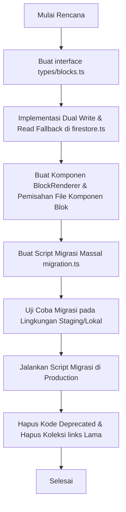

# Proposal Implementasi Block System (UltraLink)

Proposal ini menyajikan rencana teknis dan langkah-langkah transisi untuk mengubah arsitektur tautan datar (**flat link system**) saat ini di UltraLink menjadi **Block System** yang dinamis dan polimorfik. 

Dengan Block System, pengguna tidak hanya dapat menambahkan tautan URL standar, tetapi juga tipe konten lain seperti **Heading (Pemisah Seksi)**, **Text/Bio/Markdown**, **Social Row (Ikon Sosial Media Baris)**, **Image/Banner**, dan **Embed Video**.

---

## 1. Struktur Folder Baru

Untuk mendukung sistem blok yang fleksibel dan modular, struktur folder akan dirancang agar pemisahan tugas (*separation of concerns*) antara editor (dashboard) dan penampil (public renderer) tetap terjaga. 

Berikut adalah usulan perubahan struktur direktori di dalam `src/`:

```text
src/
├── types/
│   ├── index.ts              # Tetap menyimpan tipe umum (UserProfile, dll.)
│   └── blocks.ts             # [BARU] Definisi interface TypeScript untuk semua jenis blok
│
├── services/
│   ├── firestore.ts          # Abstraksi Firestore diperbarui untuk mendukung blocks
│   └── migration.ts          # [BARU] Script migrasi data links lama ke blocks
│
├── config/
│   └── blockRegistry.tsx     # [BARU] Konfigurasi tipe blok, batasan role, dan ikon pembantu
│
├── components/
│   ├── blocks/               # [BARU] Komponen renderer untuk halaman publik /[username]
│   │   ├── BlockRenderer.tsx # Router utama yang memutuskan blok apa yang harus dirender
│   │   ├── LinkBlock.tsx     # Renderer untuk blok tautan (pengganti LinkButton.tsx)
│   │   ├── HeadingBlock.tsx  # Renderer seksi/label
│   │   ├── TextBlock.tsx     # Renderer blok tulisan/bio tambahan
│   │   ├── SocialRowBlock.tsx# Renderer baris ikon sosial media
│   │   └── ImageBlock.tsx    # Renderer blok gambar kustom/banner
│   │
│   └── dashboard/
│       └── blocks/           # [BARU] Komponen editor blok untuk panel kontrol
│           ├── BlockList.tsx # List blok dengan fitur Drag-and-Drop (DND)
│           ├── BlockEditorWrapper.tsx # Wrapper modal/inline form editor berdasarkan tipe blok
│           ├── editors/
│           │   ├── LinkBlockEditor.tsx
│           │   ├── HeadingBlockEditor.tsx
│           │   ├── TextBlockEditor.tsx
│           │   ├── SocialRowBlockEditor.tsx
│           │   └── ImageBlockEditor.tsx
│           └── AddBlockButton.tsx # Tombol pilih jenis blok baru yang ingin ditambahkan
│
└── app/
    ├── [username]/
    │   ├── page.tsx          # Menggunakan <BlockRenderer /> untuk merender list blok aktif
    │   └── LinkButton.tsx    # [DEPRECATED] Akan dihapus setelah migrasi frontend selesai
    │
    └── dashboard/
        ├── links/            # [DEPRECATED] Folder ini tetap dipertahankan untuk backward compatibility
        │   └── page.tsx      # Melakukan redirect permanen (301/302) ke /dashboard/blocks
        └── blocks/           # [BARU] Halaman panel kontrol baru untuk kelola Block System
            └── page.tsx      # Menggunakan <BlockList /> dan antarmuka editor blok baru
```

---

## 2. Interface Baru (TypeScript)

Menggunakan pola **Discriminated Union** untuk memastikan tipe data setiap jenis blok aman secara statis (*statically type-safe*). Setiap blok memiliki properti umum yang diturunkan dari `BaseBlock` dan properti data unik sesuai dengan tipenya.

Definisi tipe data diletakkan di file baru `src/types/blocks.ts`:

```typescript
import { Timestamp } from "firebase/firestore";

// Tipe blok yang didukung
export type BlockType = "link" | "heading" | "text" | "social_row" | "image" | "video";

// Atribut dasar yang dimiliki oleh semua blok
export interface BaseBlock {
  id: string;
  userId: string;
  type: BlockType;
  position: number;      // Urutan render (ascending)
  isActive: boolean;     // Switch aktif/nonaktif
  createdAt: Timestamp | Date;
  updatedAt?: Timestamp | Date;
}

// 1. Link Block (Padanan dari UserLink lama)
export interface LinkBlock extends BaseBlock {
  type: "link";
  data: {
    title: string;
    url: string;
    icon?: string;       // Slug ikon dari platform registry
  };
}

// 2. Heading Block (Pemisah / Subjudul)
export interface HeadingBlock extends BaseBlock {
  type: "heading";
  data: {
    text: string;
    style?: "h1" | "h2" | "h3";
  };
}

// 3. Text Block (Deskripsi / Bio Tambahan)
export interface TextBlock extends BaseBlock {
  type: "text";
  data: {
    content: string;     // Mendukung teks biasa atau markdown sederhana
  };
}

// 4. Social Row Block (Ikon-ikon sosial media horizontal)
export interface SocialIconItem {
  platform: string;      // Contoh: 'instagram', 'github', 'linkedin'
  url: string;
}

export interface SocialRowBlock extends BaseBlock {
  type: "social_row";
  data: {
    links: SocialIconItem[];
    alignment?: "left" | "center" | "right";
  };
}

// 5. Image/Banner Block (Visual promo atau foto)
export interface ImageBlock extends BaseBlock {
  type: "image";
  data: {
    imageUrl: string;    // Di-upload ke Cloudinary
    altText?: string;
    destinationUrl?: string; // URL opsional jika gambar diklik
    aspectRatio?: "square" | "video" | "banner";
  };
}

// 6. Video Embed Block (YouTube / Vimeo)
export interface VideoBlock extends BaseBlock {
  type: "video";
  data: {
    url: string;         // URL video (akan diproses untuk mendapatkan ID embed)
    title?: string;
  };
}

// Discriminated Union type untuk konsumsi UI & Services
export type UserBlock = 
  | LinkBlock 
  | HeadingBlock 
  | TextBlock 
  | SocialRowBlock 
  | ImageBlock 
  | VideoBlock;
```

---

## 3. Strategi Migrasi (Migration Strategy)

Karena aplikasi saat ini sedang berjalan secara langsung (production) dengan data aktif di koleksi `links`, kita perlu melakukan migrasi database tanpa menyebabkan downtime (*zero-downtime database migration*).

### Tahap 1: Persiapan Koleksi Baru (`blocks`)
Kita akan menggunakan koleksi baru Firestore bernama **`blocks`** agar tidak mengganggu query aktif pada koleksi `links` selama masa transisi.

### Tahap 2: Dual Write & Service Fallback (Fase Rilis Menengah)
Sebelum melakukan pemindahan data massal, kode backend/service di `src/services/firestore.ts` akan diperbarui terlebih dahulu:
1. **Pembaruan `addLink` / `updateLink` / `deleteLink`:**
   Setiap ada penulisan data tautan baru dari dashboard, sistem akan menulis secara ganda (**Dual Write**):
   - Menulis ke koleksi lama `links` (struktur lama).
   - Menulis ke koleksi baru `blocks` dengan memetakan datanya ke struktur `LinkBlock`.
2. **Pembaruan `getUserLinks` (Read Fallback):**
   Fungsi pembacaan data diubah menjadi pintar:
   - Pertama, query data dari koleksi `blocks`.
   - Jika dokumen di koleksi `blocks` untuk `userId` tersebut kosong, sistem akan mengambil data dari koleksi lama `links`, memetakan data tersebut ke format `UserBlock[]` secara dinamis di memori, lalu mengembalikannya ke UI.

### Tahap 3: Eksekusi Script Migrasi Massal (One-Time Migration)
Kita akan membuat script migrasi mandiri di `src/services/migration.ts` yang dapat dijalankan sekali oleh Admin melalui CLI atau dashboard admin tersembunyi.

**Alur Logika Script Migrasi:**
1. Mengambil seluruh dokumen dari koleksi `links`.
2. Membaca data dan memetakannya menjadi objek `LinkBlock` baru. ID dokumen Firestore baru disamakan dengan ID dokumen `links` lama demi menjaga integritas data analitik (lihat bagian Kompatibilitas Mundur).
3. Melakukan batch write (menggunakan `writeBatch` Firestore) ke koleksi `blocks`.
4. Menandai akun tersebut telah termigrasi (opsional, dengan menambahkan flag `migratedToBlocks: true` pada dokumen user di koleksi `users`).

### Tahap 4: Deprecate Koleksi Lama
Setelah script selesai berjalan dan seluruh akun terverifikasi memiliki data di koleksi `blocks`, kita dapat menghapus logika penulisan ganda (Dual Write) serta menghapus koleksi lama `links` dari Firestore.

---

## 4. Kompatibilitas Mundur (Backward Compatibility)

Transisi ke Block System harus menjamin bahwa pengguna aktif tidak merasakan gangguan, link mereka tidak rusak, dan data analitik tidak hilang.

### A. Kompatibilitas Analitik Klik (Firestore `analytics` Collection)
Saat ini, analitik dihitung berdasarkan kunci ID dokumen tautan (`linkId` di koleksi `analytics`).
- **Solusi:** Saat melakukan migrasi data dari `links` ke `blocks`, ID dokumen `blocks` baru **wajib menggunakan ID yang persis sama** dengan dokumen `links` asalnya.
- Dengan cara ini, fungsi `trackLinkClick(blockId)` dan penghitungan analitik di dashboard akan terus bekerja secara instan tanpa perlu mengubah struktur koleksi `analytics`.

### B. Kompatibilitas Komponen Render (`LinkButton`)
Untuk mencegah halaman publik `/[username]` mengalami kerusakan sewaktu perpindahan data:
- Service `getUserLinks` (yang nanti diganti secara bertahap menjadi `getUserBlocks`) akan mengembalikan array objek bertipe `UserBlock[]`.
- Pada `/[username]/page.tsx`, rendering link tidak lagi menggunakan iterasi langsung ke `<LinkButton />`, melainkan dialihkan ke komponen sentral `<BlockRenderer block={block} />`.
- Komponen `BlockRenderer` akan memiliki fallback otomatis: jika mendeteksi tipe data lama yang belum termigrasi (meskipun seharusnya sudah ditangani oleh read fallback di service layer), ia akan memetakannya langsung ke format render `<LinkBlock />`.

Contoh implementasi `BlockRenderer.tsx` yang kompatibel:
```tsx
import { UserBlock } from "@/types/blocks";
import LinkBlockComponent from "./LinkBlock";
import HeadingBlockComponent from "./HeadingBlock";
// Import renderer blok lainnya...

export default function BlockRenderer({ block, accentColor, isLightTheme }: { 
  block: any; // Menggunakan any sementara untuk backward compatibility objek lama
  accentColor: string;
  isLightTheme: boolean;
}) {
  // Deteksi jika data masih bertipe UserLink lama (tidak memiliki properti 'type')
  const blockType = block.type || "link";
  
  // Normalisasi data jika tipe data lama terdeteksi
  const normalizedBlock: UserBlock = block.type ? block : {
    id: block.id,
    userId: block.userId,
    type: "link",
    position: block.position,
    isActive: block.isActive,
    createdAt: block.createdAt,
    data: {
      title: block.title,
      url: block.url,
      icon: block.icon
    }
  };

  switch (blockType) {
    case "link":
      return <LinkBlockComponent block={normalizedBlock as LinkBlock} accentColor={accentColor} isLightTheme={isLightTheme} />;
    case "heading":
      return <HeadingBlockComponent block={normalizedBlock as HeadingBlock} />;
    // case tipe lainnya...
    default:
      return null;
  }
}
```

### C. Pembatasan 5 Tautan untuk Akun Free (Business Logic)
Saat ini ada batasan 5 tautan untuk akun `free` pada tingkat penambahan data.
- **Kebijakan Baru:** Batasan 5 unit akan disesuaikan menjadi "maksimal 5 blok aktif secara keseluruhan" atau "maksimal 5 blok bertipe `link`".
- Rekomendasi teknis adalah membatasi jumlah total blok aktif untuk pengguna gratis menjadi maksimal 5 blok untuk menjaga kesederhanaan aturan. Logika pengecekan di `addBlock` (pengganti `addLink`) akan menghitung jumlah dokumen di koleksi `blocks` dengan filter `userId` yang sama.

---

## 5. Ringkasan Rencana Aksi (Action Plan Summary)



Proposal ini menjamin transisi yang aman, terukur, dan terstruktur tanpa memutus layanan pengguna UltraLink yang sedang berjalan.
